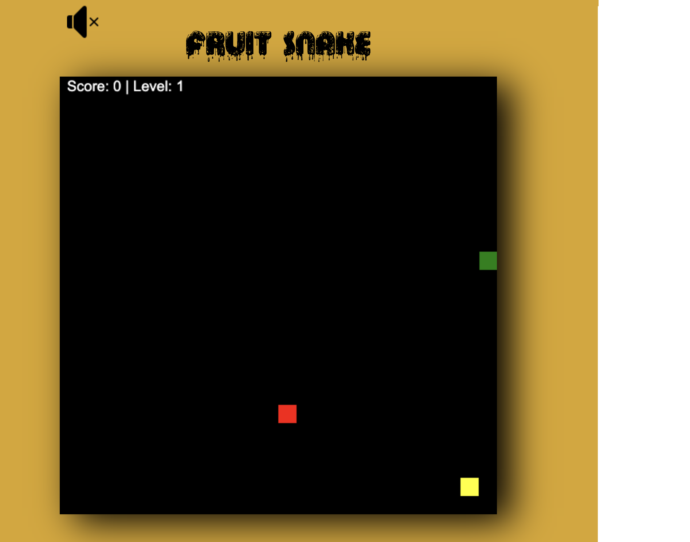
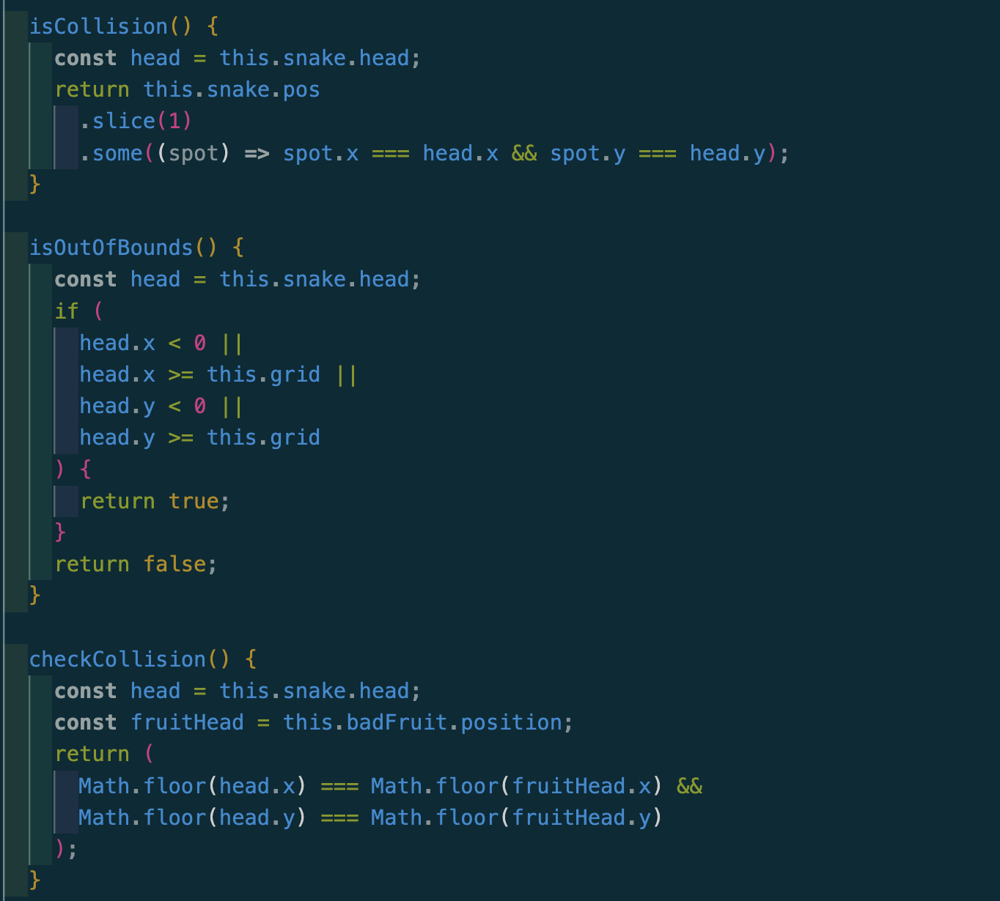
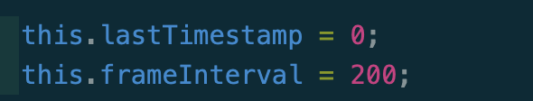
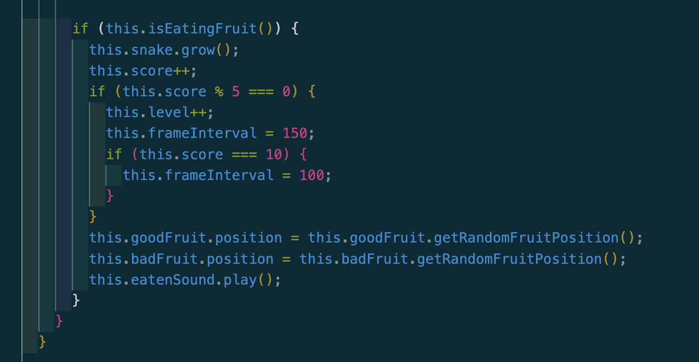
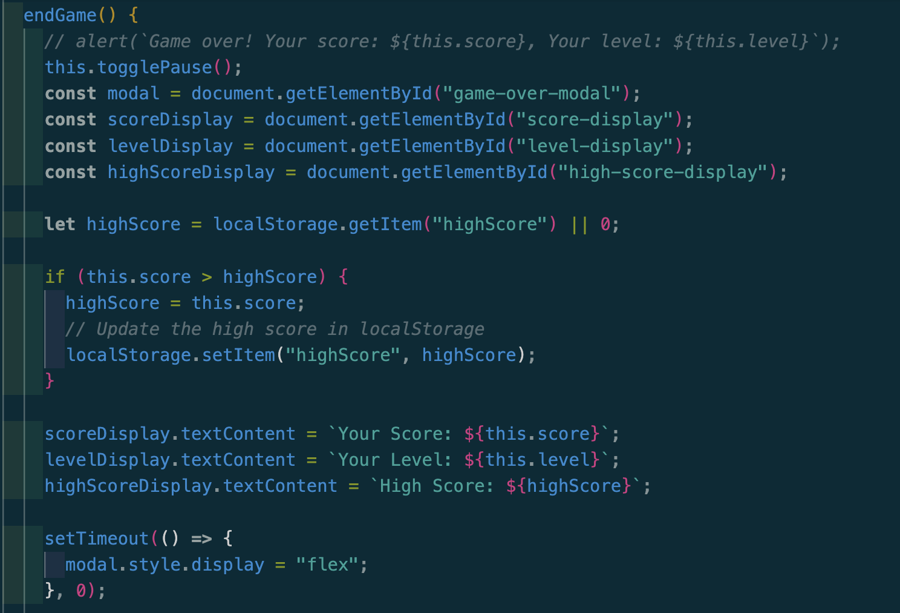

# Fruit Snake Project Proposal

## Background

Experience the classic Snake Game in JavaScript! Guide your snake around the screen to eat fruits and get longer. Be careful, though! If you accidentally munch on a bad fruit, it's game over. Test your skills and see how long you can make your snake grow without making a wrong move. Enjoy the simplicity and challenge of this timeless game brought to life with JavaScript, HTML, CSS, Canvas!

[play here!](https://farhatt18.github.io/Fruit-Snake/)

## Functionality & MVPs

In the Snake Game, users will be able to:

- Use the arrow keys to control the snake's movement.
- Eat fruits to increase the length of the snake.
- End the game if the snake eats a bad fruit, collides with its own tail or the game boundaries.
- The level will affect the speed of the snake.
- Display the score based on the number of fruits eaten.

Additionally, the project will include:

- A start screen with instructions on how to play.

## Wireframes

## Technologies, Libraries, APIs

Fruit Snake project will primarily use:

- **HTML5 Canvas API:** To render the game graphics.
- **JavaScript:** For game logic and user input handling.
- **CSS:** For styling the game elements.

### Checking Collisions

- In here, it checks if the snake's head is in the same position as the other parts of the body the game ends. In order to check the position it uses the snake head's x position and y position and iterates through the other parts of the body with their x position and y position to find if there was collison to end the game.

### Implementing Speed of the Snake

- In here, the speed will adjust based on score. When score hits 5 the frameInterval will change to 150 making the speed faster and when the score hits 10 it goes more faster.

### LocalStorage

### Future Implementations:

- Add sprites for fruits and snake.
- Make sure the fruits always pop up on screen.
- Add sounds on the main screen before the game starts.

### CC Licensing:

- Favicons by [Icon8](https://icons8.com/)
- Sounds by [Pixabay](https://pixabay.com/)
- Fonts by [FontSpace](https://www.fontspace.com/category/fancy)
