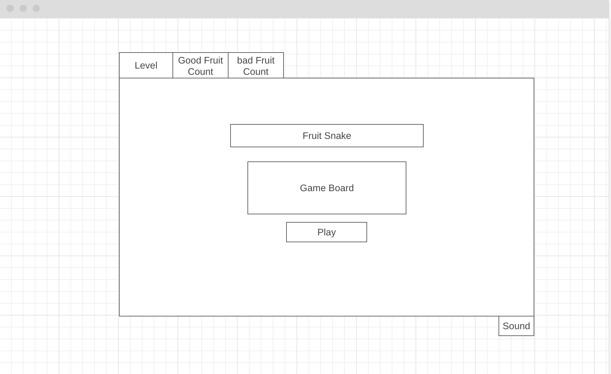

# Fruit Snake Project Proposal

## Background
Experience the classic Snake Game in JavaScript! Guide your snake around the screen to eat fruits and get longer. Be careful, though! If you accidentally munch on a bad fruit, it's game over. Test your skills and see how long you can make your snake grow without making a wrong move. Enjoy the simplicity and challenge of this timeless game brought to life with JavaScript, HTML, CSS, Canvas!

## Functionality & MVPs
In the Snake Game, users will be able to:

- Use the arrow keys to control the snake's movement.
- Eat fruits to increase the length of the snake.
- End the game if the snake eats a bad fruit, collides with its own tail or the game boundaries.
- The level will affect how quickly fruits appears.
- Display the score based on the number of fruits eaten.

Additionally, the project will include:

- A start screen with instructions on how to play.

## Wireframes

*Description of major sections and layout.*

## Technologies, Libraries, APIs
Fruit Snake project will primarily use:

- **HTML5 Canvas API:** To render the game graphics.
- **JavaScript:** For game logic and user input handling.
- **CSS:** For styling the game elements.

No external libraries or APIs are planned for this project.

## Implementation Timeline

### Friday Afternoon & Weekend:
- Set up the project repository and basic project structure.
- Implement the game grid and snake rendering.
- Allow the snake to move based on arrow key input.

### Monday:
- Implement the logic to generate and display fruits on the game grid.
- Implement the logic for snake growth when it eats a fruit.
- Display the score and the level on the game screen.
- Implement sound button to have the option mute and unmute.

### Tuesday:
- Implement collision detection to end the game if the snake collides with itself.
- Style the game elements using CSS for a visually appealing design.
- Create a start screen with instructions on how to play.

### Wednesday:
- Implement responsive design to ensure the game works well on different devices.
- Test the game thoroughly to identify and fix any bugs.

### Thursday Morning:
- Prepare for the project presentation.

### Thursday Afternoon (Presentation):
- Present the Snake Game project, highlighting its features and functionality.
